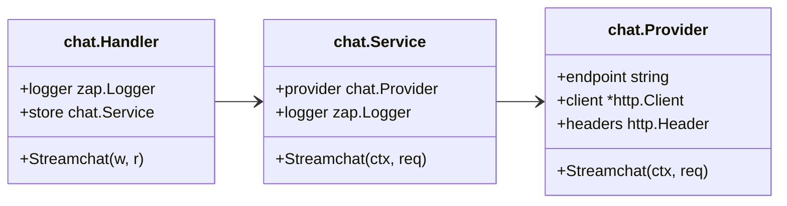

```mermaid
classDiagram
	direction LR
	
	class chat.Handler{
			+Streamchat(w, r)
			+logger zap.Logger
			+store chat.Service
	}
	
	class chat.Service{
			+Streamchat(ctx, req)
			+provider chat.Provider
			+logger zap.Logger
	}
	
	class chat.Provider{
			+endpoint string
			+client *http.Client
			+headers http.Header
			+Streamchat(ctx, req)
	}
	
	chat.Handler --> chat.Service
	chat.Service --> chat.Provider
```