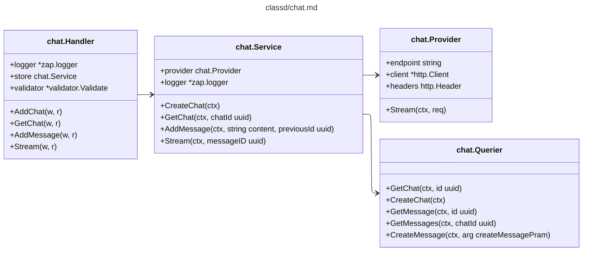

```mermaid
---
title: classd/chat.md
config:
    layout: elk
---

classDiagram
	direction LR
	
	class chat.Handler{
			+AddChat(w, r)
			+GetChat(w, r)
			+AddMessage(w, r)
			+Stream(w, r)
			+logger *zap.logger
			+store chat.Service
			+validator *validator.Validate
	}
	
	class chat.Service{
			+CreateChat(ctx)
			+GetChat(ctx, chatId uuid)
			+AddMessage(ctx, string content, previousId uuid)
			+Stream(ctx, messageID uuid)
			+provider chat.Provider
			+logger *zap.logger
	}
	
	class chat.Provider{
			+endpoint string
			+client *http.Client
			+headers http.Header
			+Stream(ctx, req)
	}
	
	class chat.Querier{
		+GetChat(ctx, id uuid)
		+CreateChat(ctx)
		+GetMessage(ctx, id uuid)
		+GetMessages(ctx, chatId uuid)
		+CreateMessage(ctx, arg createMessagePram)
	}
	
	chat.Handler --> chat.Service
	chat.Service --> chat.Provider
	chat.Service --> chat.Querier
```