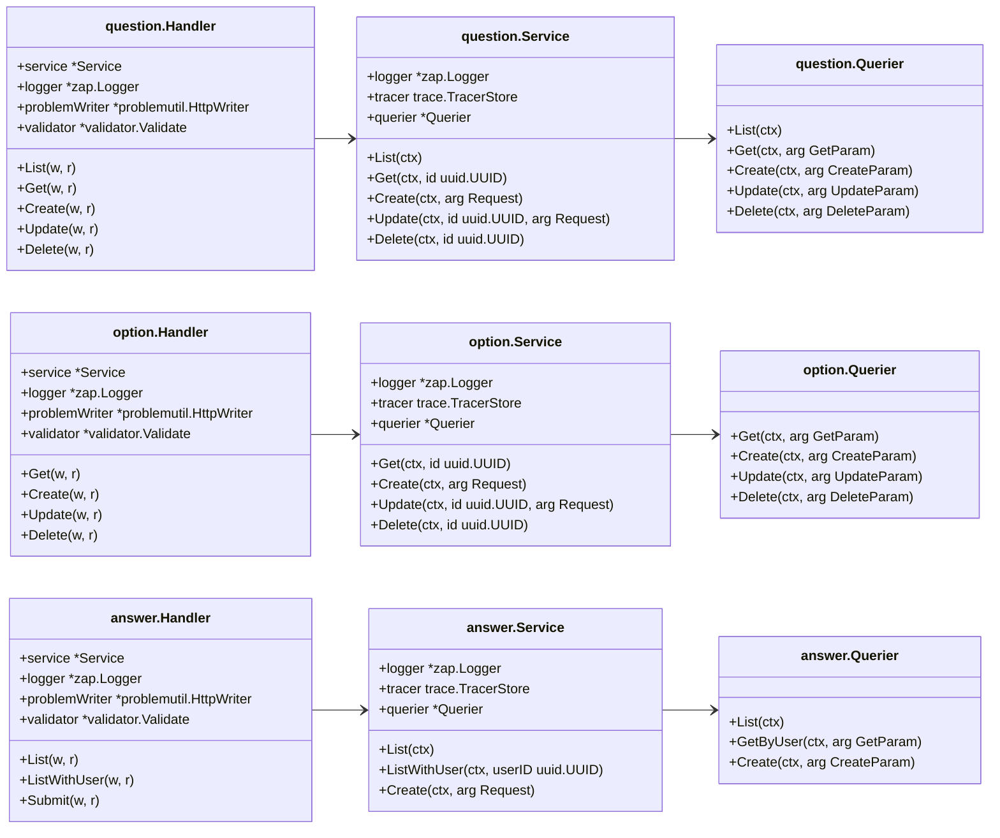

```mermaid
classDiagram
    direction LR

    %% Handler Layer
    class question.Handler {
        +service *Service
        +logger *zap.Logger
        +problemWriter *problemutil.HttpWriter
        +validator *validator.Validate
        
        +List(w, r)
        +Get(w, r)
        +Create(w, r)
        +Update(w, r)
        +Delete(w, r)
    }

    class option.Handler {
        +service *Service
        +logger *zap.Logger
        +problemWriter *problemutil.HttpWriter
        +validator *validator.Validate
        
        +Get(w, r)
        +Create(w, r)
        +Update(w, r)
        +Delete(w, r)
    }

    class answer.Handler {
        +service *Service
        +logger *zap.Logger
        +problemWriter *problemutil.HttpWriter
        +validator *validator.Validate
        
        +List(w, r)
        +ListWithUser(w, r)
        +Submit(w, r)
    }

    %% Service Layer
    class question.Service {
        +logger *zap.Logger
        +tracer trace.TracerStore
        +querier *Querier
        
        +List(ctx)
        +Get(ctx, id uuid.UUID)
        +Create(ctx, arg Request)
        +Update(ctx, id uuid.UUID, arg Request)
        +Delete(ctx, id uuid.UUID)
	}

    class option.Service {
        +logger *zap.Logger
        +tracer trace.TracerStore
        +querier *Querier
        
        +Get(ctx, id uuid.UUID)
        +Create(ctx, arg Request)
        +Update(ctx, id uuid.UUID, arg Request)
        +Delete(ctx, id uuid.UUID)
    }
    
    class answer.Service {
        +logger *zap.Logger
        +tracer trace.TracerStore
        +querier *Querier
        
        +List(ctx)
        +ListWithUser(ctx, userID uuid.UUID)
        +Create(ctx, arg Request)
    }

    %% Querier & Model Layer


    class question.Querier {
        +List(ctx)
        +Get(ctx, arg GetParam)
        +Create(ctx, arg CreateParam)
        +Update(ctx, arg UpdateParam)
        +Delete(ctx, arg DeleteParam)
    }

    class option.Querier {
        +Get(ctx, arg GetParam)
        +Create(ctx, arg CreateParam)
        +Update(ctx, arg UpdateParam)
        +Delete(ctx, arg DeleteParam)
    }

    class answer.Querier {
        +List(ctx)
        +GetByUser(ctx, arg GetParam)
        +Create(ctx, arg CreateParam)
    }
 
    %% Relations
    question.Handler --> question.Service
    option.Handler --> option.Service
    answer.Handler --> answer.Service
    
    question.Service --> question.Querier
    option.Service --> option.Querier
    answer.Service --> answer.Querier
```