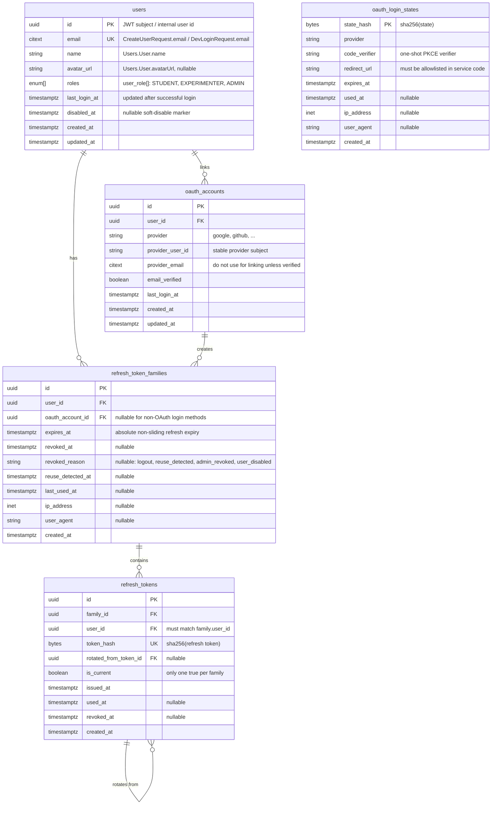
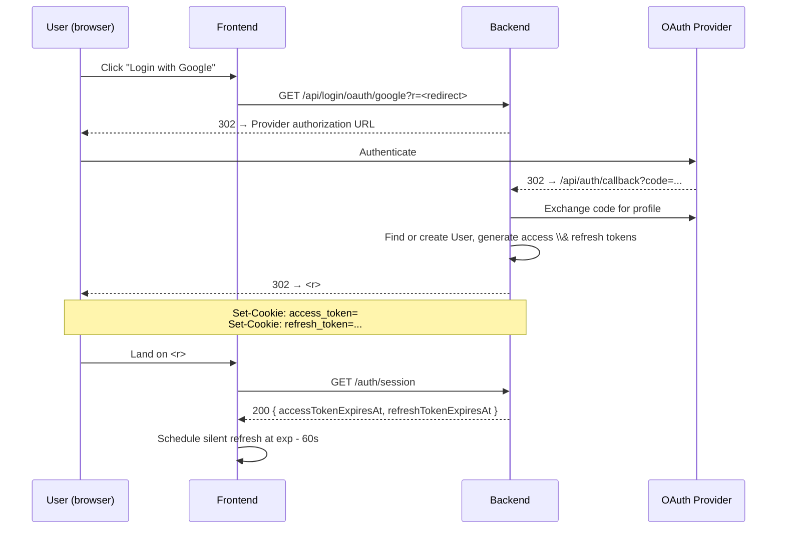
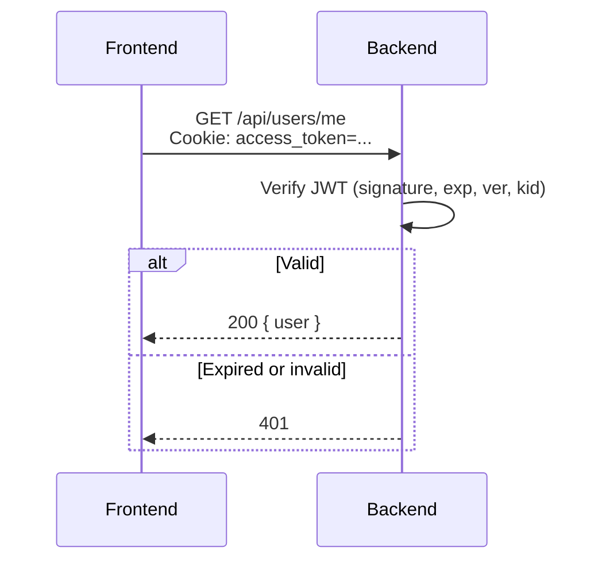
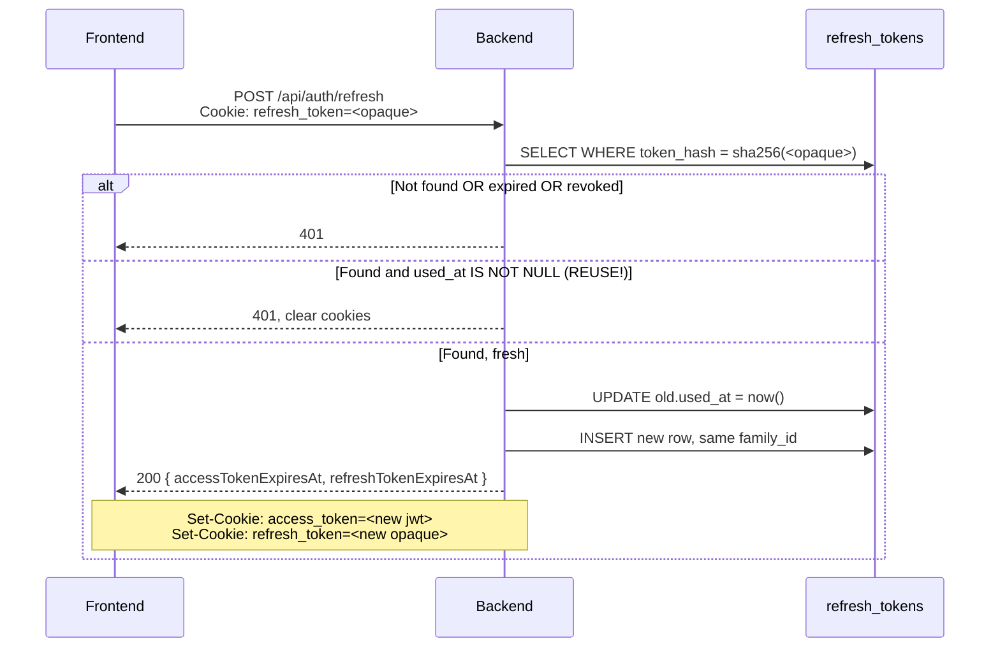
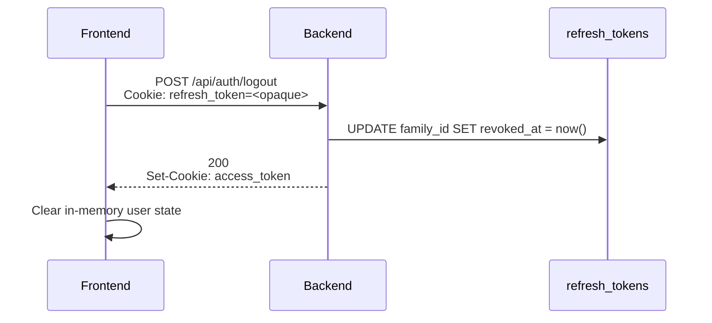

# Overview

This document specifies a fully backend-managed, cookie-based JWT authentication scheme. The defining property of this design is that **no token is ever exposed to JavaScript**. The browser holds the credentials in `HttpOnly` cookies, the backend issues and rotates them, and the frontend's only role in the auth lifecycle is to decide when to call `/auth/refresh` and how to recover after long absences.

# Rules to follow

Write table-driven tests covering `session`, `refresh`, `logout`, and middleware 401 behaviors.

You have to **write the test first**, including several common test and edge conditions. After your implementation, you have to run the test to see the correctness.

# API Spec

https://nycu-sdc.github.io/sciedu-api/#tag/auth

# Goals

- Use the middleware to handle the `access token` JWT cookie validation.
- Provide a user identity interface for chat, such as `UserIDFromContext(ctx)`.
- HTTP-only cookies only. Access and refresh tokens are never readable from the page context. A successful XSS does not equal a stolen session.
- Short access token (15 min), long refresh token (30 days). Compromise of an access token has bounded blast radius; the refresh token is revocable.
- Stateless verification on the hot path. Verifying an access token requires no DB round trip
- To support this authentication flow, the backend must support two behaviors:  `dev` and `prod`, with the default being production and dev mode toggleable by environment variable `ENVIRONMENT=dev`. (Read in config or `.env` file)
- Use Google OAuth as provider.

# Auth Related Table



# File Structure

Implement auth system in `internal/auth` folder. Split the system into three layer: `handle.go`, `service.go`, `queries.sql` (use `sqlc` to generate for `queries.go`)

## Authentication Flows

This section presumes the reader is familiar with the OAuth 2.0 specification. If not, feel free to checkout this article from our fellow core system developer [So What Is OAuth? A Deep Dive into OAuth 2.0 and PKCE | Yorukot](https://yorukot.me/blog/so-what-is-oauth/)

### OAuth Login

1. The user initializes the sign-in request on in the frontend, having the frontend navigate to `/api/login/oauth/google`

    - This request provides a URL parameter `r` (the redirect URL), which specifies where the backend redirects users after the sign in
    - An example of `r` would be `https://sciedu.sdc.nycu.club/courses/genetics` , i.e., after the user has signed in, the backend redirects the user to the sign in page
2. The backend receives get request `https://sciedu.sdc.nycu.club/api/login/oauth/google?r=https://sciedu.sdc.nycu.club/courses/genetics` , and sends a response redirecting the browser to the OAuth authorization server (we use Google as an _example_ for the rest of this spec, but please note that this can change as we add more OAuth providers and please don’t hard code it). The server URL can look something like this

   `{{<https://accounts.google.com/o/oauth2/v2/auth?response_type=code&state={state}>}}&code_challenge={code_challenge}&code_challenge_method=S256&...`

    - Please note that, following the recommendations of RFC 9700, we will be using PKCE with the code challenge method being S256.
    - We will be requesting the scope of `email` ,`profile` and `openid`, with the complete list available for reference [here](https://developers.google.com/identity/protocols/oauth2/scopes#google-sign-in)
    - Have Google redirect to `https://sciedu.sdc.nycu.club/api/auth/callback`
    - Note that since the Google auth server only echos back `code` and `state`, the redirect URL must be included in state
3. The user completes the authentication flow on Google's end and Google redirects back to the callback URL. The backend then

    1. Exchanges the code and PKCE code verifier for the access token. The request looks something like

        ```jsx
        POST <https://oauth2.googleapis.com/token>
        Content-Type: application/x-www-form-urlencoded
        
        grant_type=authorization_code
        &code={code}
        &redirect_uri={redirect_uri}
        &client_id={client_id}
        &client_secret={client_secret}
        &code_verifier={code_verifier}
        ```

    2. Upon obtaining the response, decode and validate the `id_token` jwt provided by Google’s OpenID, and extract the user’s email from there

4. Redirect the user back to the frontend, setting cookies `access_token` and `refresh_token` with further specification below


A simplified overview of this flow would look like



The frontend learns expiry timestamps via `/auth/session` — it cannot decode the JWT itself. This is the single piece of metadata it needs to drive the silent-refresh schedule.

### Authenticated Request



No DB read on the happy path. Verification is signature + claim checks.

### Token Refresh



Two cookies are reissued on every refresh. The old refresh token is marked `used_at` but kept (not deleted) so we can detect replay.

### Logout



Logout revokes the entire refresh family, not just the current token. A user who clicks "log out" expects every chain that descends from that login to die.

The access token is not blocklisted — it expires on its own within 15 minutes. If that window is unacceptable for a particular operation (rare), the operation can do a short-circuit DB check on `jti`.

## Token Architecture

### Access Token

|Property|Value|
|---|---|
|Format|JWT, signed `HS256` (single backend) or `RS256`/`EdDSA` (multi-service)|
|Lifetime|**15 minutes** from issuance|
|Storage|`access_token` cookie|
|Backend state|None — verified statelessly via signature|
|Cookie Attrs|Domain: [sciedu.sdc.nycu.club](http://sciedu.sdc.nycu.club); HttpOnly; SameSite=Lax; Path=/; Max-Age=900; Secure (only in prod mode)|

`SameSite=Lax` (not `Strict`) on the access cookie so that top-level navigations from external links (email confirmations, OAuth redirects) carry the session.

**Claims:**

```json
{
  "sub": "3c5fa073-7b97-43a3-bc44-ddc98f390a08",  // user uuid
  "iat": 1735689000,
  "exp": 1735689900,                              // iat + 15*60
}
```

### Refresh Token

The refresh token is **not** a JWT. It carries no claims. The server alone knows what it means. This makes revocation cheap (delete or mark a row) and theft detection possible (we can tell when the same row is presented twice).

|Property|Value|
|---|---|
|Format|UUID|
|Lifetime|**30 days** from issuance, **non-sliding**|
|Storage|`refresh_token` cookie|
|Backend state|Row in `refresh_tokens` table, token stored as SHA-256 hash|
|Cookie Attrs|Domain: [sciedu.sdc.nycu.club](http://sciedu.sdc.nycu.club); HttpOnly; SameSite=Strict; Path=/api/auth; Max-Age=2592000; Secure (only in prod)|

Two important narrowings beyond the access cookie:

- **`Path=/api/auth`** — the refresh cookie is sent only to `/auth/*` endpoints. Application code never sees it; only the auth handlers do. Reduces accidental logging and exposure surface.
- **`SameSite=Strict`** — the refresh cookie is never sent on cross-site requests, including top-level navigations. There is no legitimate cross-site flow that needs the refresh token.

### Why two tokens?

Stateless JWT for the hot path (every API call) and a stateful opaque token for the rare path (refresh, logout, ~96 times per 30-day window per user). We get cheap verification _and_ revocation/rotation/theft-detection. A single stateful access token would couple every API call to the auth DB; a single stateless 30-day JWT would be unrevocable.

## Backend Implementation Notes

### JWT signing keys

Single-service deployment: HS256 with a 256-bit secret in the secrets store.

### Clock skew

Allow ±60s clock skew when verifying `exp` and `nbf`. The 60s pre-expiry refresh buffer on the frontend makes this rarely matter, but it's free insurance.

### CORS

Note that since the frontend’s origin is different than the backend, CORS gets involved. Two common pitfalls here, one is that `Access-Control-Allow-Origins` must never be `*` else the same-site cookie settings break. Also the frontend `fetch` calls must use `credentials: 'include'`.

### PKCE

Even though we are a confidential client with a real `client_secret`, we run PKCE on every OAuth flow per RFC 9700. PKCE here is not replacing client authentication — it's stacked on top of it. The reason is that PKCE also defends against authorization code injection, where an attacker who can plant a code into our callback (via an open redirect, a misconfigured logging proxy, browser history leak, etc.) cannot complete the exchange because they don't have the verifier. Belt and braces; cheap to add.

The flow is:

1. At step 2 of OAuth Login, generate a fresh `code_verifier`: 64 bytes from a CSPRNG, base64url-encoded, which lands inside the 43–128 char range RFC 7636 requires. Do not reuse verifiers across requests.
2. Compute `code_challenge = BASE64URL(SHA256(code_verifier))` and send it with `code_challenge_method=S256` on the authorization request. We never use `code_challenge_method=plain`; if a provider doesn't support S256 we refuse to integrate.
3. Store the `code_verifier` server-side, keyed by the `state` value (see below). A short-lived in-memory cache is the natural home — it must outlive the user's Google round trip but not much longer, and it must be single-use.
4. On callback, look up the verifier by `state`, send it as `code_verifier` in the POST body to Google's token endpoint, and delete the cache entry whether or not the exchange succeeds. Re-presenting the same verifier should not be possible.

Common pitfalls:

- The `state` value is the join key for verifier lookup, redirect URL preservation, and CSRF protection on the callback. If any of those three uses are split across different keys, something is wrong.
- The verifier must never be logged. It is a one-shot secret, but a verifier that ends up in an access log for a provider that doesn't bind PKCE to the issued code (some don't) becomes replayable for the lifetime of the access log.
- The cache must be single-use (delete on read), not just TTL'd. Otherwise a concurrent or replayed callback could reuse the same verifier.
- If we later add a provider that doesn't support PKCE, the abstraction should refuse to register it rather than silently dropping the verifier — failing closed is much easier to notice than failing open.

### Why no anti-CSRF tokens on state-changing requests

A cookie-based session is the classic environment where you'd reach for double-submit cookies or synchronizer tokens. We don't, and the reasoning chains through three layers of defense that already exist in this design. Documenting it here so future readers don't paper over a real gap with a reflex.

**Layer 1: `SameSite` on the cookies themselves.** The refresh cookie is `SameSite=Strict` and scoped to the auth path — it cannot be attached by a cross-site context at all, including a top-level navigation. The access cookie is `SameSite=Lax`, which means it is _not_ attached to cross-site sub-resource requests (the `fetch`/`XHR`/form-POST shape that CSRF exploits depend on). It is attached only to top-level navigations initiated by the user clicking a link or being redirected, and on those it's only attached for "safe" methods — GET and HEAD. This is the property that anti-CSRF tokens are doing the work of, and modern browsers do it natively now.

**Layer 2: REST conventions.** The `Lax` carve-out for cross-site top-level GETs only matters if a GET endpoint changes state. None of ours do. GET is read-only and side-effect-free across the API; state changes are POST/PUT/PATCH/DELETE only. Reviewers should treat a state-changing GET as a defect, not as a choice, because it would silently bypass the SameSite defense.

**Layer 3: CORS.** Cross-origin `fetch` against the backend is constrained by CORS. We do not echo arbitrary `Origin` values into `Access-Control-Allow-Origin` (and per the CORS note above, we cannot, because we send `Access-Control-Allow-Credentials: true`). An attacker site cannot script a same-origin-looking request against the API, and a cross-origin one will either be preflighted-and-rejected or its response will be unreadable.

The threat that a double-submit CSRF token _would_ additionally cover is the residual top-level form-POST case where SameSite is `Lax` — but as noted, Lax does not attach the cookie to POSTs from a cross-site context in the first place, so the residual is empty. The threats it wouldn't cover (XSS reading the token from the page, malicious browser extensions, network MITM on a misconfigured TLS deployment) are also not addressed by a CSRF token; they require the more aggressive `SameSite=Strict` plus CSP plus HSTS posture this design already takes for the refresh cookie.

We will revisit this decision if any of the following change:

- Any state-changing endpoint accepts GET.
- The refresh cookie's `SameSite` is downgraded from `Strict`.
- The access cookie's `SameSite` is downgraded from `Lax` (e.g. for cross-site embeds).
- Target browser baseline drops below the SameSite-default era (Chrome 80, Feb 2020). Any browser old enough not to honor SameSite by default is also old enough to have unpatched RCEs, so we'd have bigger problems.

## Appendix A: Complete request lifecycle (worked example)

A user logs in Monday at 10:00, closes the laptop at 18:00, opens it Wednesday at 09:00.

|Time|Event|What happens|
|---|---|---|
|Mon 10:00:00|OAuth completes|`R_login` issued; access JWT exp = 10:15:00; frontend schedules silent refresh for 10:14:00|
|Mon 10:14:00|Silent refresh fires|`R_login` → `used`; `R2` issued; new JWT exp = 10:29:00; timer rescheduled for 10:28:00|
|Mon 10:14:00 → 18:00:00|Active use|~31 silent refreshes, family chain `R_login → R2 → ... → R32`|
|Mon 18:00:00|Laptop closes|Tab suspends; `setTimeout` does not fire while suspended on most platforms|
|Wed 09:00:00|Laptop opens|`visibilitychange` → visible. `onResume()` checks: `accessTokenExpiresAt` is in the past (Mon ~18:14). Calls `/auth/refresh` immediately.|
|Wed 09:00:01|Refresh succeeds|`R32` was the active token at suspend; it's still valid (not yet 30 days old); `R33` issued; user keeps working.|
|...|...|...|
|Wed 09:00:00 + 30d|Refresh fails|`R_login`'s family hits its absolute 30-day cap; `/auth/refresh` returns 401; frontend bounces to login.|

The user's experience: log in once on Monday, work uninterrupted for nearly a month before being asked to log in again — without ever holding a token that JavaScript can read.