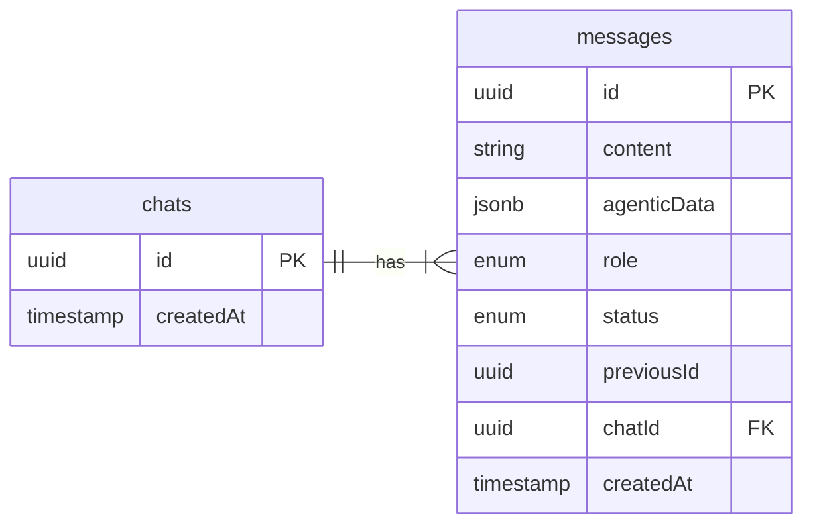

```mermaid
erDiagram
	direction LR
	
	chats ||--|{ messages : "has"
	
	chats {
		uuid id PK
		timestamp createdAt
	}
	
	messages {
		uuid id PK
		string content
		jsonb agenticData
		enum role
		enum status
		uuid previousId
		uuid chatId FK
		timestamp createdAt
	}
```
