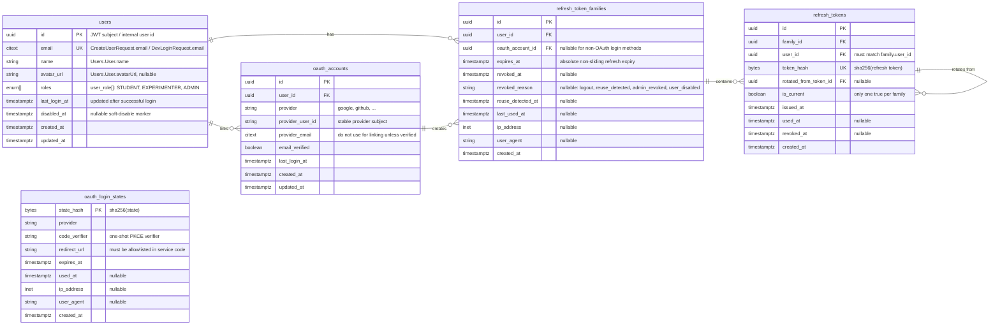

```mermaid
erDiagram
    direction LR

    users ||--o{ oauth_accounts : "links"
    users ||--o{ refresh_token_families : "has"
    oauth_accounts ||--o{ refresh_token_families : "creates"
    refresh_token_families ||--o{ refresh_tokens : "contains"
    refresh_tokens ||--o{ refresh_tokens : "rotates from"

    users {
        uuid id PK "JWT subject / internal user id"
        citext email UK "CreateUserRequest.email / DevLoginRequest.email"
        string name "Users.User.name"
        string avatar_url "Users.User.avatarUrl, nullable"
        enum[] roles "user_role[]: STUDENT, EXPERIMENTER, ADMIN"
        timestamptz last_login_at "updated after successful login"
        timestamptz disabled_at "nullable soft-disable marker"
        timestamptz created_at
        timestamptz updated_at
    }

    oauth_accounts {
        uuid id PK
        uuid user_id FK
        string provider "google, github, ..."
        string provider_user_id "stable provider subject"
        citext provider_email "do not use for linking unless verified"
        boolean email_verified
        timestamptz last_login_at
        timestamptz created_at
        timestamptz updated_at
    }

    refresh_token_families {
        uuid id PK
        uuid user_id FK
        uuid oauth_account_id FK "nullable for non-OAuth login methods"
        timestamptz expires_at "absolute non-sliding refresh expiry"
        timestamptz revoked_at "nullable"
        string revoked_reason "nullable: logout, reuse_detected, admin_revoked, user_disabled"
        timestamptz reuse_detected_at "nullable"
        timestamptz last_used_at "nullable"
        inet ip_address "nullable"
        string user_agent "nullable"
        timestamptz created_at
    }

    refresh_tokens {
        uuid id PK
        uuid family_id FK
        uuid user_id FK "must match family.user_id"
        bytes token_hash UK "sha256(refresh token)"
        uuid rotated_from_token_id FK "nullable"
        boolean is_current "only one true per family"
        timestamptz issued_at
        timestamptz used_at "nullable"
        timestamptz revoked_at "nullable"
        timestamptz created_at
    }

    oauth_login_states {
        bytes state_hash PK "sha256(state)"
        string provider
        string code_verifier "one-shot PKCE verifier"
        string redirect_url "must be allowlisted in service code"
        timestamptz expires_at
        timestamptz used_at "nullable"
        inet ip_address "nullable"
        string user_agent "nullable"
        timestamptz created_at
    }
```
