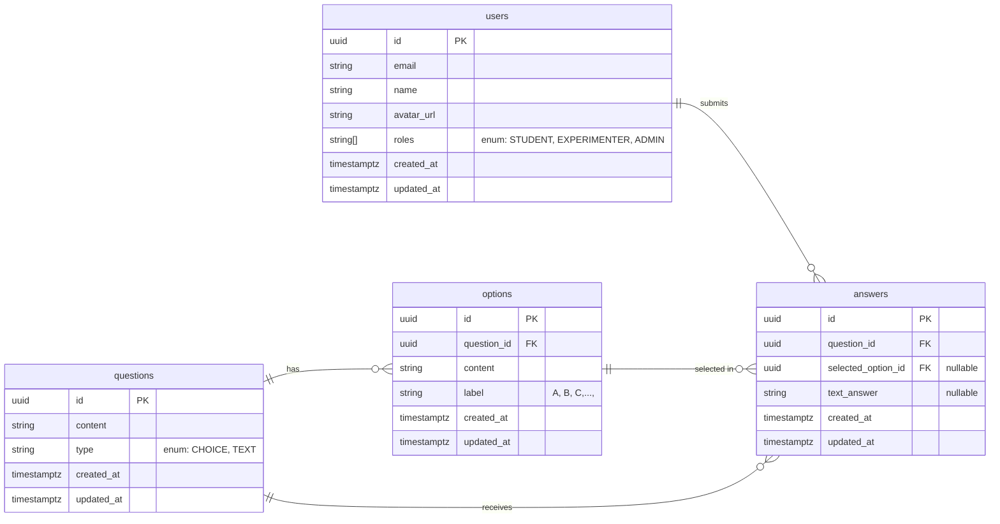

```mermaid
erDiagram
    direction LR
	
	questions ||--o{ options : "has"
	users ||--o{ answers : "submits"
	options ||--o{ answers : "selected in"
	questions ||--o{ answers : "receives"
	
	users {
		uuid id PK
		string email
		string name
		string avatar_url
		string[] roles "enum: STUDENT, EXPERIMENTER, ADMIN"
		timestamptz created_at
		timestamptz updated_at
	}
	
	questions{
		uuid id PK
		string content
		string type "enum: CHOICE, TEXT"
		timestamptz created_at
		timestamptz updated_at
	}
	
	options {
		uuid id PK
		uuid question_id FK
		string content
		string label "A, B, C,..., "
		timestamptz created_at
		timestamptz updated_at
	}
	
	answers {
		uuid id PK
		uuid question_id FK
		uuid selected_option_id FK "nullable"
		string text_answer "nullable"
		timestamptz created_at
		timestamptz updated_at
	}
```